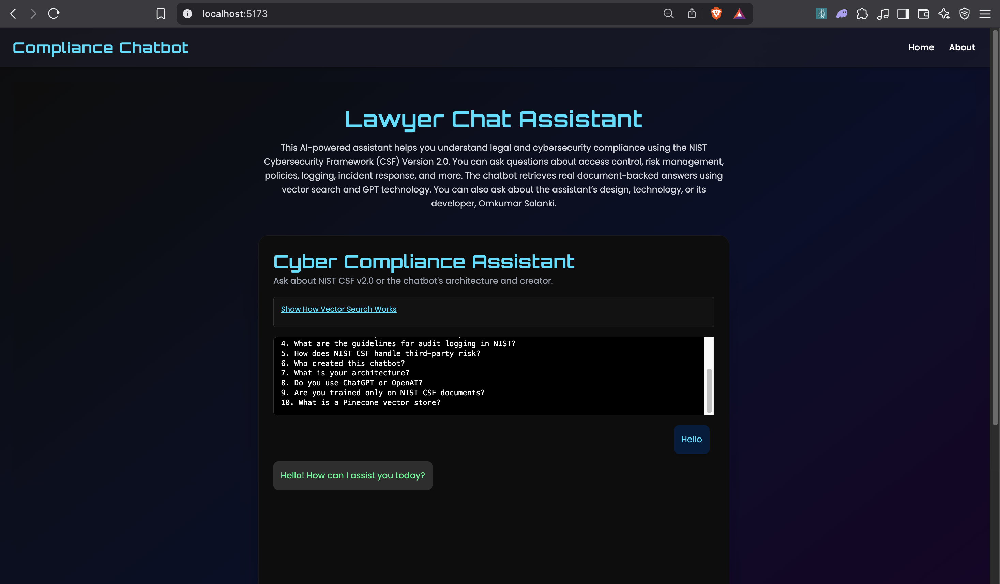
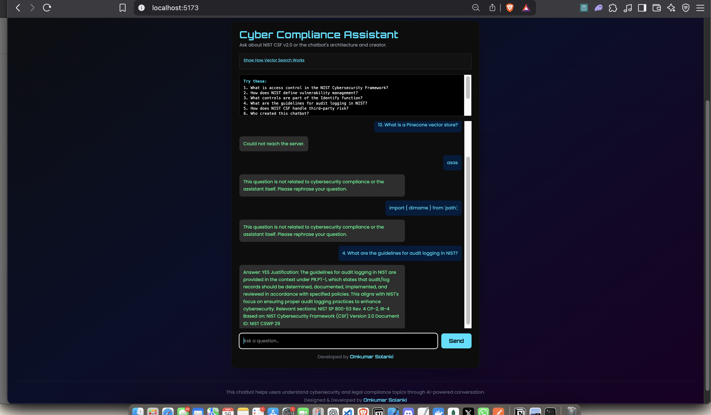
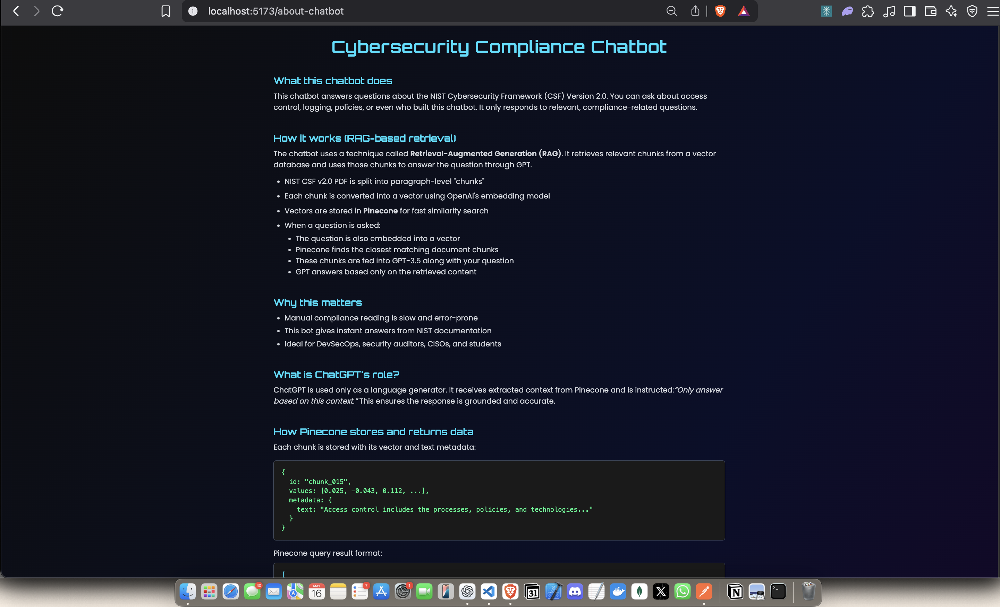
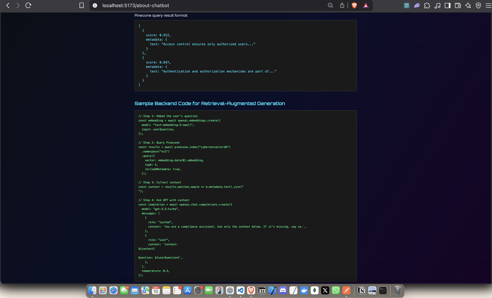
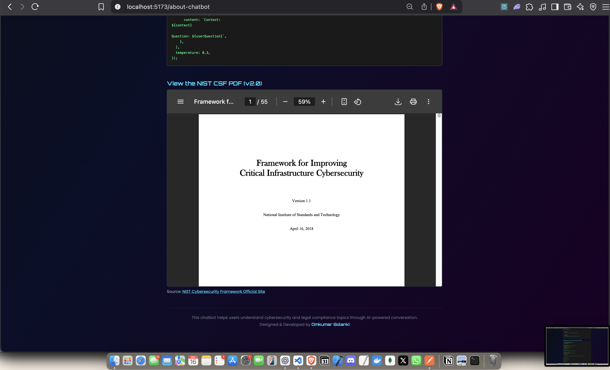

# 🔐 Cybersecurity Compliance Chatbot (RAG-based)

A sleek, interactive AI chatbot designed to answer questions using the **NIST Cybersecurity Framework (CSF) v2.0**. Built with **React**, **Node.js**, **OpenAI GPT-3.5**, and **Pinecone vector DB**, it retrieves relevant PDF chunks and responds with document-grounded answers.

> Ideal for **DevSecOps**, **auditors**, and **security teams** seeking quick NIST-aligned insights.

---

## 🚀 Tech Stack

* **Frontend**: React + Vite + Tailwind CSS
* **Backend**: Node.js + Express
* **LLM**: OpenAI GPT-3.5 Turbo
* **Embedding**: `text-embedding-3-small`
* **Vector Store**: Pinecone
* **Styling**: Dark theme + Orbitron & Poppins fonts

---

## 💡 What the Chatbot Can Answer

### 📘 Cybersecurity Topics:

* Access Control
* Security Procedures
* Risk Management
* Logging, Recovery, Compliance

### 🧠 About the Assistant:

* Who built it?
* What tech powers it?
* How is it different from ChatGPT?

---

## 🔁 How It Works (RAG Flow)

1. 📄 PDF is split into paragraphs (chunks)
2. 🧠 Each chunk is embedded via OpenAI
3. 🗃️ Stored in Pinecone with metadata
4. 🙋‍♂️ User's question is embedded
5. 🔍 Pinecone returns top-matching chunks
6. 🤖 GPT-3.5 is prompted with these chunks
7. ✅ Response is based ONLY on matched content

---

## 🧪 Sample Backend Code (RAG Pipeline)

```ts
const embedding = await openai.embeddings.create({
  model: 'text-embedding-3-small',
  input: userQuestion,
});

const results = await pinecone.index('cybersecvectordb')
  .namespace('ns1')
  .query({
    vector: embedding.data[0].embedding,
    topK: 5,
    includeMetadata: true,
  });

const context = results.matches.map(m => m.metadata.text).join('\n');

const completion = await openai.chat.completions.create({
  model: 'gpt-3.5-turbo',
  messages: [
    { role: 'system', content: 'You are a compliance assistant. Use ONLY the provided context.' },
    { role: 'user', content: `Context:\n${context}\n\nQuestion: ${userQuestion}` },
  ],
});
```

---

## 📸 Screenshots

### 🏠 Home Page



### 💬 Chat UI Example



### 📊 Vector Retrieval Explained





---

## 📂 Folder Overview

```
cyber_RAG_chatbot/
├── backend/               # Node.js API for OpenAI & Pinecone
│   └── server.js
├── frontend/my-react-app/
│   ├── src/
│   │   ├── components/    # ChatBox.tsx, AboutChatBot.tsx
│   │   └── pages/         # Home.tsx, AboutChatbot.tsx
│   └── public/            # Screenshots, PDF file
├── README.md
```

---

## ⚙️ How to Run Locally

### Backend

```bash
cd backend
npm install
node server.js
```

### Frontend

```bash
cd frontend/my-react-app
npm install
npm run dev
```

---

## 👤 Developer Info

**Omkumar Vijaysinh Solanki**
🔗 [LinkedIn](https://www.linkedin.com/in/omkumar-solanki-atluxuarywxtchbusinessmandeveloper2/)
💻 [GitHub](https://github.com/tcoders16)
🛠️ Full Stack Dev | Web3 | AI/ML | GPT | iOS

---

## 📄 License

MIT License
